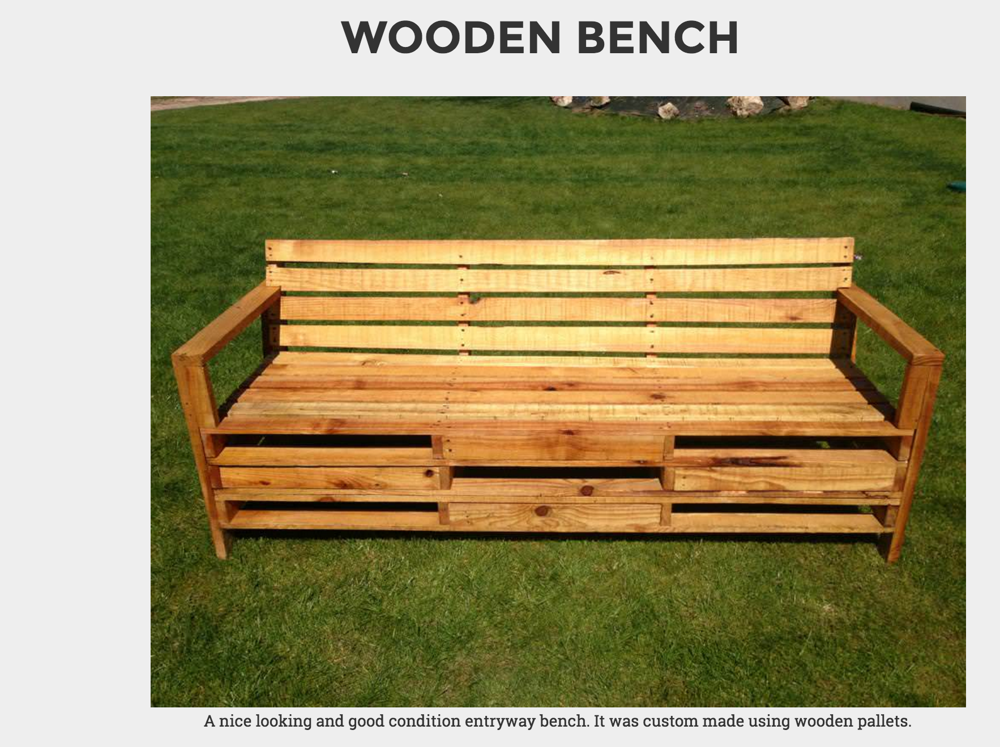

# Helping Hands

## Problem
> There are lot of things we buy, use and then get rid of them by throwing them in the garbage. Reducing solid waste is reducing the amount of trash that goes to landfills. Reduce, Reuse and Recycle are the most common methods to reduce landfill waste. One of the worst things about landfill 

is that so much of the solid waste is still of value to many. So how can we find an easy way for people to recycle and reuse items, instead of trashing them?

## Solution
> An application that helps people to list reusable items that they no longer need so that someone can make good use of it. 

## Benefits
* Reduces landfill waste
* Allows people to save money
* Creates a sense of sharing

## Application Usage Tutorial

> On your browser type in https://helpinghands.herokuapp.com/

> Select category and/or zipcode and click OK

> For the category and zipcode, application displays the available listings. The count besides Search Results shows number of available listings. The Google Map shows with markers, the location of the listings. Clicking individual marker, popups with address and a link to listing details.
> Below the Google Map, the individual listings are also displayed.

> Hover on the listing image and you will find image changing to yellow box with plus sign. Click the image.

> Clicking the image shows page with enlarged image of the listing and other information.

> To create new listing, click Create Listing from Navigation menu.

> If not logged in, the Account Sign In page is shown. If you have not created an account, the Account Sign Up page is shown.

> After successfully logged in, Create Signin page is shown for creating a new listing.

> To delete existing listing, click Delete Listing from Navigation menu.

> Click Delete Listing, shows page with all the listings for the user.

> To reach out to us, use Contact Us from Navigation menu. Entering information and submitting will send automatically an email with the entered information.

> Click SignOut to exit from signed in profile.

> You do not have to sign in to the profile to view listings of anyone.

## Project Members
* Gurjit Kaur
* Anand Gopalakrishnan
* David Li

## License
> Distributed under the open license.